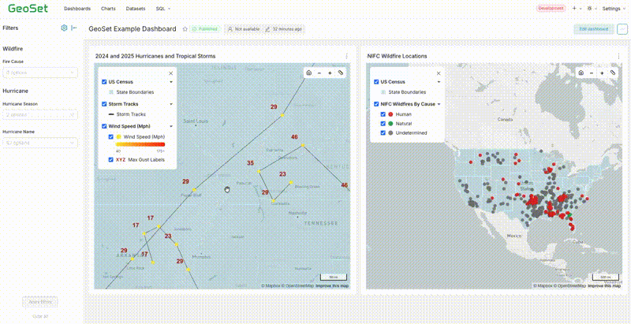
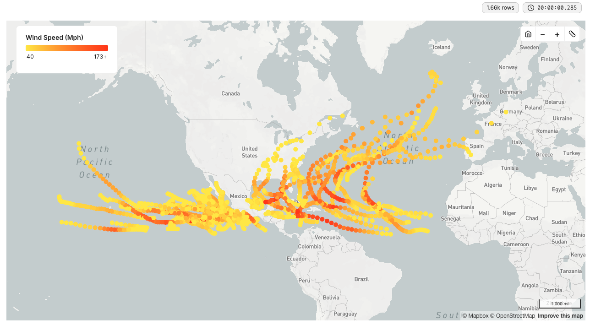
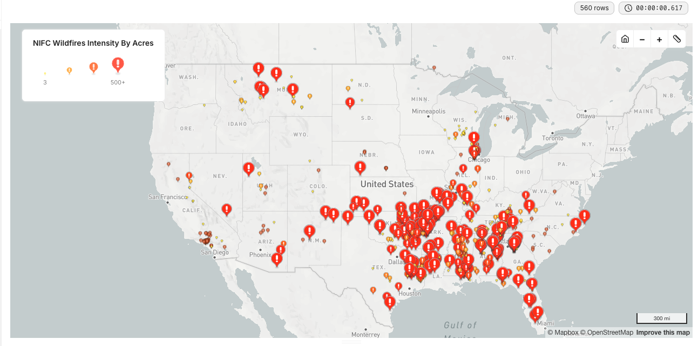
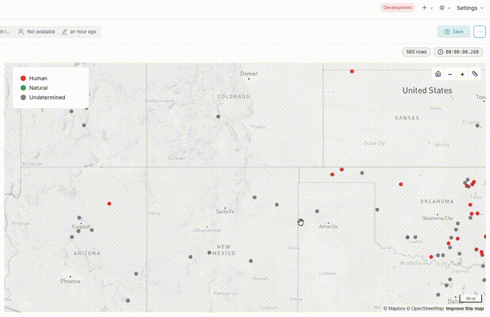
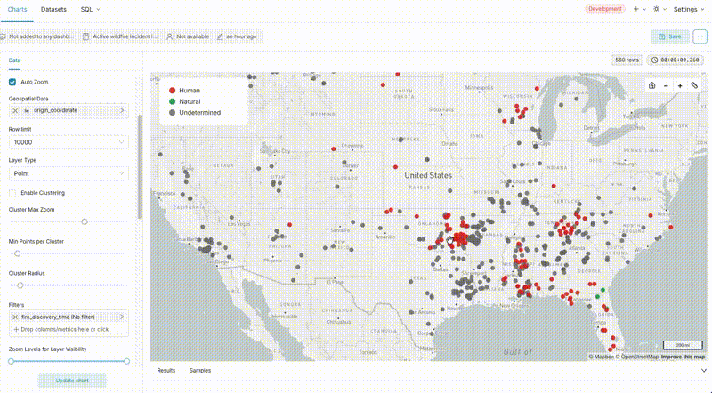
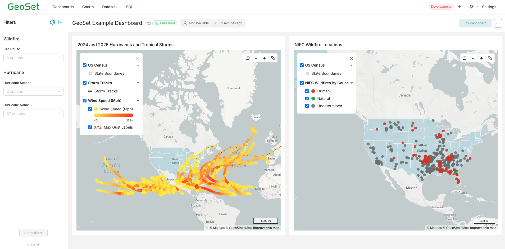

<p align="center">
  
</p>

<p align="center">

[](https://opensource.org/license/apache-2-0)
[](https://github.com/apache/superset)
[](https://postgis.net/)
[](https://www.docker.com/)
[](https://deck.gl/)

</p>

<p align="center">
  
</p>

__GeoSet brings robust geospatial visualization capabilities to [Apache Superset](https://github.com/apache/superset) with native [PostGIS](https://postgis.net/) compatibility.__

- [What is GeoSet?](#what-is-geoset)
- [How GeoSet Differs from Apache Superset](#how-geoset-differs-from-apache-superset)
- [Quick Start](#quick-start)
  - [Step 1 - Create a Copy of docker/.env.example](#step-1---create-a-copy-of-dockerenvexample)
  - [Step 2 - Launch Docker Compose](#step-2---launch-docker-compose)
    - [Alternative Docker Image](#alternative-docker-image)
  - [Step 3 - Open GeoSet and Explore](#step-3---open-geoset-and-explore)
- [Contributing](#contributing)
  - [Development Guide](#development-guide)

## What is GeoSet?

GeoSet bridges the gap between Superset and GIS tooling. This is accomplished by extending Apache Superset with custom deck.gl-based map visualization plugins purpose-built for geospatial data. It allows users to visualize points, lines, and polygons stored natively within PostGIS's `Geography` or `Geometry` data types. Features include:

- Single and multilayer maps
- Visibility toggling by zoom
- Hover over and additional details pane
- Color by category or value
- Collapsible legend with layer toggling and dynamic iconography
- Native dashboard integration

<p align="center">
  
</p>

<table>
  <tr>
    <td align="center"><strong>Color by Metric</strong></td>
    <td align="center"><strong>Dynamic Point Sizing</strong></td>
  </tr>
  <tr>
    <td></td>
    <td></td>
  </tr>
  <tr>
    <td align="center"><strong>Ruler &amp; Tooltip</strong></td>
    <td align="center"><strong>Point Clustering</strong></td>
  </tr>
  <tr>
    <td></td>
    <td></td>
  </tr>
</table>

## How GeoSet Differs from Apache Superset

GeoSet is an extension of Superset. Everything that can be done within Superset can be done within GeoSet. GeoSet was created to improve Superset's geospatial visualization capabilities. While Superset _does_ provide various map charts, their functionality is limited and varying data formatting requirements and inconsistent configurability make them difficult to use.

## Quick Start

There is a Docker Compose file at the root of the repository. This file is based off [docker-compose-light.yml](https://github.com/apache/superset/blob/master/docker-compose-light.yml) in the upstream Apache Superset repository. We add a PostGIS database service to the stack and preload it with example data. 

### Step 1 - Create a Copy of docker/.env.example

Create a copy of the the file [docker/.env.example](./docker/.env.example) and store at `docker/.env`.

```bash
cp docker/.env.example docker/.env
```

You'll need to supply a Mapbox API key in order to render the maps. Update the line `MAPBOX_API_KEY=''` with your Mapbox API token. You can create a token for free within your Mapbox account. Create the token, copy it into the quotes, and save the file.

### Step 2 - Launch Docker Compose

Run the following command from the root of the repository. GeoSet will be accessible at [http://localhost:9001] with username `admin` and password `admin` when the build completes. This can take about 5 to 10 minutes on the first run.

```bash
docker compose up
```

#### Alternative Docker Image

The Dockerfile at the root of the repository uses the same Debian-based image used by upstream Superset. This image suffers from numerous high and critical CVEs. For environments with increased security requirements we offer a hardened image based on RHEL 8 with 0 critical and 0 fixable high CVEs. This image can be used in place of the Debian image by running the following command. Note, these images have identical behavior.

```bash
DOCKERFILE=Dockerfile.rhel docker compose up
```

### Step 3 - Open GeoSet and Explore

We've created an example dashboard accessible at [http://localhost:9001/superset/dashboard/geoset-example-dashboard](http://localhost:9001/superset/dashboard/geoset-example-dashboard).



## Contributing

Contributions are always welcome! Please take a look at [open issues](https://github.com/raft-tech/GeoSet/issues) or you can create a new issue / feature request. __Note__: the scope of issues and feature requests must correspond with GeoSet functionality. Any issue or feature request pertaining to Superset core should be made [here](https://github.com/apache/superset/issues).

### Development Guide

Please refer to the [Development Guide](https://github.com/raft-tech/GeoSet/wiki/Development-Guide) wiki page for details regarding environment setup and details regarding core code directories for GeoSet.
