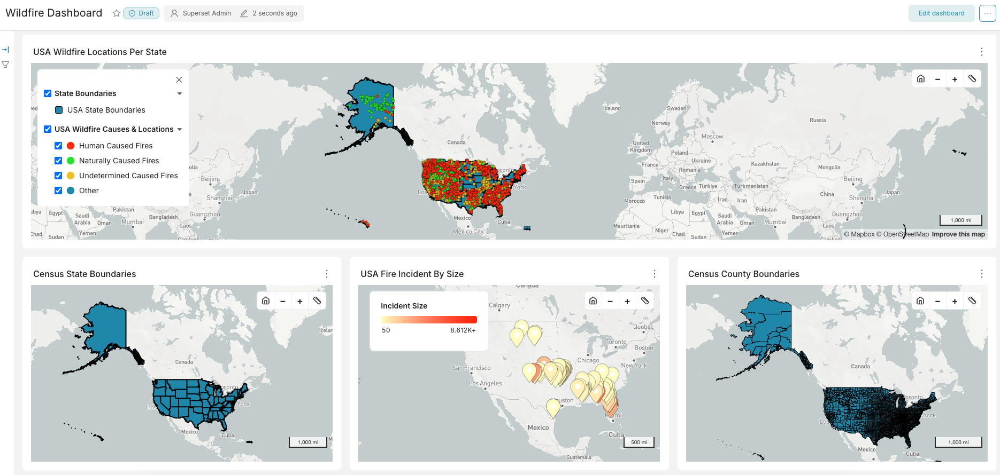
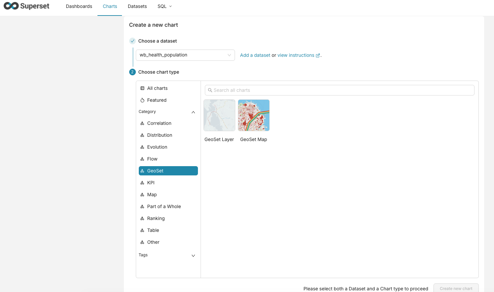
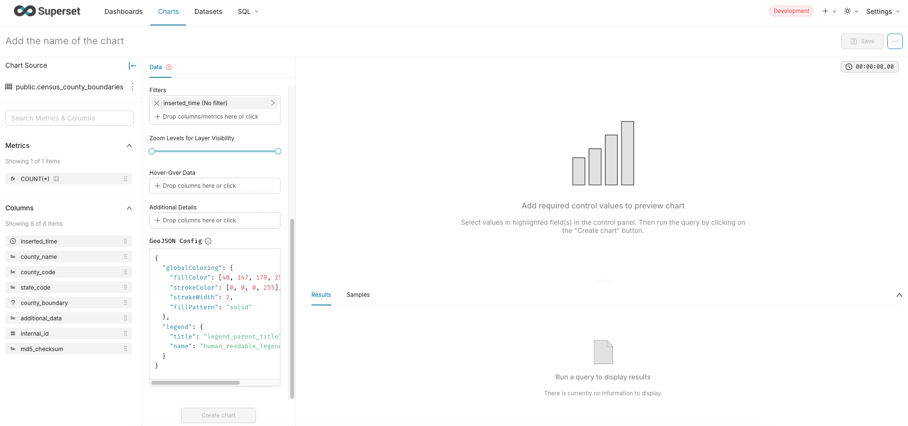
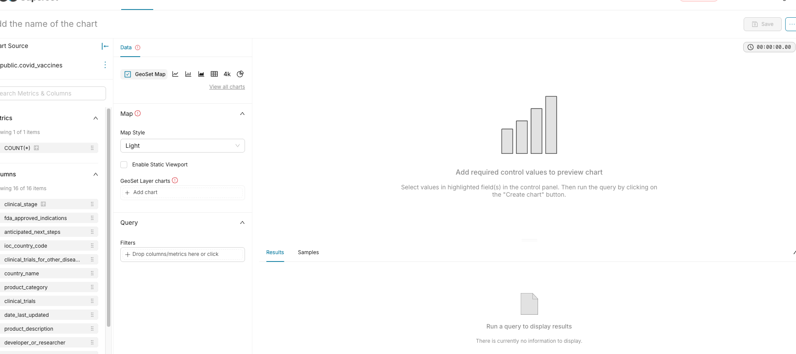
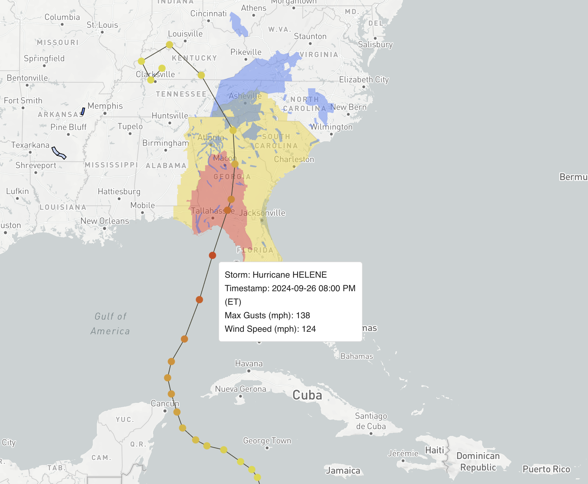
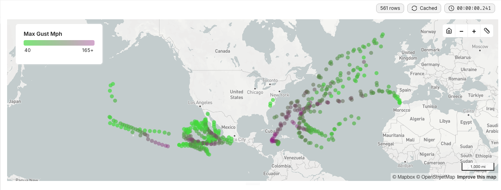
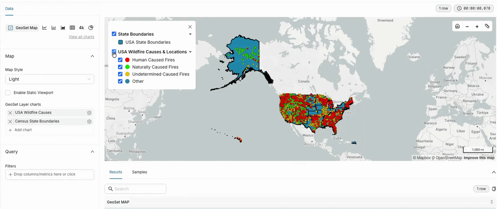
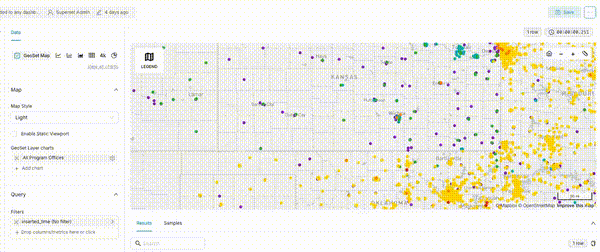
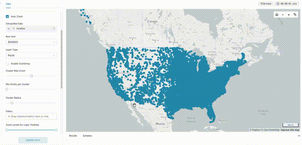

<!--
Licensed to the Apache Software Foundation (ASF) under one
or more contributor license agreements.  See the NOTICE file
distributed with this work for additional information
regarding copyright ownership.  The ASF licenses this file
to you under the Apache License, Version 2.0 (the
"License"); you may not use this file except in compliance
with the License.  You may obtain a copy of the License at

  http://www.apache.org/licenses/LICENSE-2.0

Unless required by applicable law or agreed to in writing,
software distributed under the License is distributed on an
"AS IS" BASIS, WITHOUT WARRANTIES OR CONDITIONS OF ANY
KIND, either express or implied.  See the License for the
specific language governing permissions and limitations
under the License.
-->

# GeoSet

[](https://opensource.org/license/apache-2-0)

A geospatial data monitoring and visualization platform built on [Apache Superset](https://github.com/apache/superset).



## Summary

GeoSet extends Apache Superset with a custom deck.gl-based map visualization plugin purpose-built for geospatial data exploration. It allows users to visualize geographic data (points, lines, polygons) on interactive maps with features like category-based coloring, metric gradients, clustering, measurement tools, and configurable legends — all within the familiar Superset dashboard experience.

## Purpose

GeoSet is designed for teams that need to monitor and analyze geospatial data at scale. It combines Superset's powerful data exploration capabilities (SQL editor, no-code chart builder, dashboard system, role-based access control) with specialized geospatial visualizations that go beyond what standard Superset chart types offer.

## How GeoSet Differs from Apache Superset

GeoSet is a fork of Apache Superset with the following additions:

| Feature | Superset | GeoSet |
|---|---|---|
| Map visualization | Basic deck.gl GeoJSON layer | Full-featured GeoSet Map Chart with points, lines, polygons, icons, and clustering |
| Geometry rendering | Limited styling options | Configurable fill/stroke colors, category-based coloring, metric gradient coloring, dashed lines |
| Interactivity | Basic tooltips | Hover tooltips, click popups for feature details, measurement/ruler tool, zoom-based layer visibility |
| Legends | Standard chart legends | Categorical legends with toggle/isolate, metric gradient legends, multi-layer legends |
| Performance | Default deck.gl settings | Server-side geometry simplification (PostGIS), polygon caching, GPU picking optimizations, hover throttling |
| GeoJSON configuration | Manual setup | JSON-based config with schema validation, versioned migrations, color-by-category and color-by-value modes |
| Point clustering | Not available | Supercluster-based automatic clustering with configurable radius, zoom, and min-points |

### GeoSet Chart Selection



#### GeoSet Layer Chart Builder



#### GeoSet Multi Layer Chart Builder



## Getting Started

### Prerequisites

- [Docker](https://docs.docker.com/get-docker/) and [Docker Compose](https://docs.docker.com/compose/install/)
- [Git](https://git-scm.com/)

### Clone the Repository

```bash
git clone https://github.com/raft-tech/GeoSet.git
cd GeoSet
```

### Environment Setup

1. Copy the example environment file and configure it:

```bash
cp docker/.env.example docker/.env
```

2. Edit `docker/.env` with your settings. At minimum, you should set:

```env
MAPBOX_API_KEY=<your-mapbox-token>
```

> You can get a free Mapbox access token at [mapbox.com](https://www.mapbox.com/).

### Start the Application

```bash
docker compose up -d
```

This starts all services:

| Base Service | Port | Description |
|---|---|---|
| **nginx** | 80 | Reverse proxy (main entry point) |
| **superset** | 8088 | Flask backend API |
| **superset-node** | 9000 | Webpack frontend dev server |
| **superset-websocket** | 8080 | WebSocket server for real-time updates |
| **db** | 5432 | PostgreSQL database |
| **redis** | 6379 | Cache and Celery broker |

|GeoSet Service | Port | Description |
|---|---|---|
| **nginx** | 80 | Reverse proxy (main entry point) |
| **superset** | 8088 | Flask backend API |
| **superset-node-geoset-1** | 9001 | Webpack frontend dev server (GeoSet) |
| **superset-websocket** | 8080 | WebSocket server |
| **superset_postgis** | 5433 | PostgreSQL (Geospatial data) |
| **redis** | 6379 | Cache and Celery broker |

On first run, the `superset-init` container will automatically:

- Run database migrations
- Create an admin user (`admin` / `admin`)
- Set up default roles and permissions

Once all containers are healthy, open **http://localhost** in your browser.

### Useful Commands

```bash
# Start all services (GeoSet Full Stack w/ Examples)
docker compose -f docker-compose-geoset.yml up

# Rebuild after Dockerfile changes (GeoSet stack)
docker compose -f docker-compose-geoset.yml up --build

# Start all services (Base Superset)
docker compose up -d

# View logs for a specific service
docker compose logs -f superset

# Restart the frontend dev server
docker compose restart superset-node

# Stop all services
docker compose down

# Stop and remove all data (fresh start)
docker compose down -v

# Rebuild containers after Dockerfile changes
docker compose up -d --build
```

### Local Development

For plugin development with hot reload:

```bash
# Install dependencies and build the plugins
cd superset-frontend
npm install
npm run build
# or, to build only plugins:
npm run plugins:build

# Start the dev server with hot reload
npm run dev-server

# Start all services (includes hot reload for plugin changes)
cd ..
docker compose up -d
```

### Screenshots & Videos

<!-- markdownlint-disable MD033 MD045 -->
<!-- markdownlint-enable MD033 MD045 -->




<!-- markdownlint-disable MD033 MD045 -->
<p>
  
  
</p>
<p>
  
  
</p>
<!-- markdownlint-enable MD033 MD045 -->

## Project Structure

```text
GeoSet/
├── superset/                          # Python backend (Flask)
├── superset-frontend/                 # React frontend
│   └── plugins/
│       └── geoset-map-chart/          # Custom GeoSet map visualization
│           └── src/
│               ├── layers/            # deck.gl layer implementations
│               ├── components/        # Legend, Tooltip, MapControls, etc.
│               ├── utils/             # Color utilities, geometry helpers
│               ├── buildQuery.ts      # PostGIS query builder
│               └── transformProps.ts  # Data transformation pipeline
├── superset-websocket/                # WebSocket service
├── docker/                            # Docker configuration and init scripts
└── docker-compose.yml                 # Service orchestration
```

## Contributing

We welcome contributions to GeoSet! Here's how to get started:

### Branch Strategy

- `main` — stable branch, target for all PRs
- Feature branches — create from `main` with a descriptive name (e.g., `45-polygon-performance`)

### Development Workflow

1. **Fork and clone** the repository
2. **Create a feature branch** from `main`:

   ```bash
   git checkout -b your-feature-name main
   ```

3. **Make your changes** — see the project structure above for where things live
4. **Test locally** using Docker Compose or the local dev setup
5. **Submit a PR** against `main` on [raft-tech/GeoSet](https://github.com/raft-tech/GeoSet)

### PR Guidelines

- Keep PRs focused on a single concern
- Include a clear description of what changed and why
- Add screenshots for any UI changes
- Ensure the frontend builds without errors

### Key Areas for Contribution

- **GeoSet Map Plugin** (`superset-frontend/plugins/geoset-map-chart/`) — the custom map visualization
- **Backend** (`superset/`) — API endpoints, database connectors, security
- **Docker/Infrastructure** (`docker/`) — deployment configuration, init scripts

### Resources

- [Apache Superset Contributing Guide](https://superset.apache.org/docs/contributing/)
- [Creating Viz Plugins](https://superset.apache.org/docs/contributing/creating-viz-plugins/)
- [Superset API Reference](https://superset.apache.org/docs/rest-api)

## Versioning

GeoSet follows [Semantic Versioning](https://semver.org/). The current version and release history are documented in:

- [GEOSET/VERSION.md](GEOSET/VERSION.md) — current version and versioning policy
- [GEOSET/CHANGELOG.md](GEOSET/CHANGELOG.md) — release history

## License

GeoSet is licensed under the [Apache License 2.0](https://opensource.org/license/apache-2-0). See [LICENSE](LICENSE.txt) for the full text.
